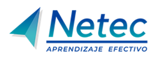

# Docker y Kubernetes

## Plataforma de laboratorios

Te damos la bienvenida a la **plataforma de laboratorios** del curso de **Docker y Kubernetes**. Aquí podrás desarrollar habilidades prácticas mediante actividades guiadas de contenerización y orquestación.

## Lista de laboratorios

Cada uno de estos laboratorios está diseñado para ofrecerte una experiencia práctica. Haz clic en los enlaces para comenzar.

### [Práctica 1. Despliegue de una aplicación Node.js simple con Docker](capitulo1/lab1.md)

- **Descripción:** Creación de una agenda de contactos con Node.js, Express y HTML, seguida de su contenerización y ejecución local con Docker.
- ⏱️ **Duración estimada:** 55 minutos.

### [Práctica 2. Operaciones esenciales con contenedores Docker](capitulo2/lab2.md)

- **Descripción:** Administración de contenedores Docker desde la terminal mediante operaciones de creación, ejecución, inspección, gestión y eliminación.
- ⏱️ **Duración estimada:** 60 minutos.

### [Práctica 3. Construcción de una imagen Docker multietapa](capitulo3/lab3.md)

- **Descripción:** Construcción y comparación de imágenes Docker tradicionales y multietapa para optimizar una aplicación Node.js con backend y frontend.
- ⏱️ **Duración estimada:** 95 minutos.

### [Práctica 4. Despliegue de una aplicación Node.js. en Kubernetes](capitulo4/lab7.md)

- **Descripción:** Despliegue en Minikube de una aplicación Node.js con Socket.IO mediante ConfigMap, Deployment con probes y Service NodePort.
- ⏱️ **Duración estimada:** 90 minutos.

### [Práctica 5. Uso de ConfigMaps, Secrets y controladores con despliegue de una app](capitulo5/lab9.md)

- **Descripción:** Despliegue de una aplicación Node.js en Minikube utilizando ConfigMaps, Secrets, Deployment, Service, Job y CronJob.
- ⏱️ **Duración estimada:** 120 minutos.

---

## 📬 **Contacto y más información**

Si tienes alguna pregunta o necesitas más detalles, no dudes en [contactarnos](mailto:soporte@netec.com). También puedes encontrar más recursos en nuestra [página](https://netec.com).

---

¡Gracias por visitar nuestra plataforma! No olvides revisar todos los laboratorios y comenzar tu viaje de aprendizaje hoy mismo.
